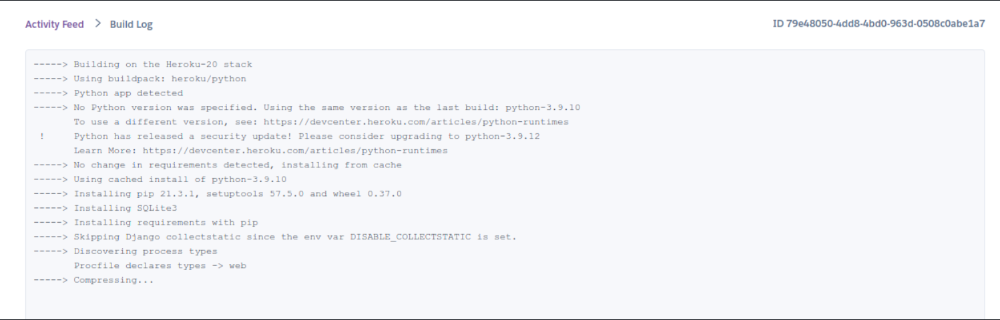

# Deployment

- The app was deployed to [Heroku](https://www.heroku.com/).
- The database was deployed to [ElephantSQL](https://www.elephantsql.com/).

- The app can be reached by the [link](https://polish-restaurant1-c6e01ddf2452.herokuapp.com/).

## Local deployment

*Note:*
  - This project requires to install all the requirements:
  - Open the terminal window and type:
  - `pip3 install -r requirements.txt`

Create a local copy of the GitHub repository by following one of the two processes below:

- Download ZIP file:
  1. Go to the [GitHub Repo page](https://github.com/aleksandrasucho/game-zone/tree/main).
  1. Click the Code button and download the ZIP file containing the project.
  1. Extract the ZIP file to a location on your PC.

- Clone the repository:
  1. Open a folder on your computer with the terminal.
  1. Run the following command
  - `git clone https://github.com/aleksandrasucho/polish-restaurant.git`

  ---

1. Install the dependencies:

    - Open the terminal window and type:
    - `pip3 install -r requirements.txt`


1. Create a `.gitignore` file in the root directory of the project where you should add env.py and __pycache__ files to prevent the privacy of your secret data.

1. Create a `.env` file. This will contain the following environment variables:

    ```python
    import os

      os.environ['SECRET_KEY'] = 'Add a secret key'
      os.environ['DATABASE_URL'] = 'will be used to connect to the database'
      os.environ['DEBUG'] = 'True'
    ```

    *During the development stage DEBUG is set to True, but it is vital to change it to False.*

1. Run the following commands in a terminal to make migrations: 
    - `python3 manage.py makemigrations`
    - `python3 manage.py migrate`
1. Create a superuser to get access to the admin environment.
    - `python3 manage.py createsuperuser`
    - Enter the required information (your username, email and password).
1. Run the app with the following command in the terminal:
    - `python3 manage.py runserver`
1. Open the link provided in a browser to see the app.

1. If you need to access the admin page:
    - Add /admin/ to the link provided.
    - Enter your username and password (for the superuser that you have created before).
    - You will be redirected to the admin page.


## Heroku Deployment

* Set up a local workspace on your computer for Heroku:
    - Create a list of requirements that the project needs to run:
      - type this in the terminal: `pip3 freeze > requirements.txt`
    - Commit and push the changes to GitHub
    
* Go to [www.heroku.com](www.heroku.com) 
* Log in or create a Heroku account.
* Create a new app with any unique name <name app>.

  

* Create a Procfile in your local workplace:

  
    
    This file will will contain the following:
    ```python
        web: gunicorn <name app>.wsgi:application
    ```
    - Commit and push the changes to GitHub.

* Go to resources in Heroku and search for postgresql. Select Hobby dev - Free and click on the provision button to add it to the project.

  

* Go to the settings app in Heroku and go to Config Vars.

  

Click on Reveal Config Vars and add the following config variables:

| Key      | Value          |
|-------------|-------------|
| DATABASE_URL | ... | 
| DISABLE_COLLECTSTATIC | 1 |
| EMAIL_HOST_PASS | ... |
| EMAIL_HOST_USER | ... |
| HEROKU_HOSTNAME | ... |
| SECRET_KEY | ... |


* Copy the value of DATABASE_URL and input it into the .env file and generate a secret key (you may use [Djecrety](https://djecrety.ir/) for secret key generation).
* Create EMAIL_HOST_PASS and EMAIL_HOST_USER with a gmail account and add values to these keys.
* Migrate changes.
* Set debug to False in settings.py
* Commit and push the changes to GitHub.
* Connect your repository to Heroku.


* Deploy the app to Heroku by clicking "Deploy Branch" button. If you want to enable auto-deployment, click "Enable Automatic Deployment".

   

The deployment process will start.

   

Click "View build logs" to see the progress of the deployment.

  


*Due to security updates, Heroku dashboard will not allow you to deploy your app from GitHub. Thus, you need to run the following commands in your terminal:*

| action | terminal command | comment |
| ------ | ---------------- | ------- |
| login to your heroku account | `heroku login -i` | |
| create a new app on heroku | `heroku create NAME-OF-YOUR-APP` | if you haven't created the app before, and then, you can access the app via the Heroku dashboard and set up your config vars.|
| add remote to your local repository | `heroku git:remote -a NAME-OF-YOUR-APP` | if you have already created app on Heroku (before the security updates) and connected it using Heroku dashboard |
| deploy new version of the app | `git push heroku main` | |
| rename app | `git remote rename NAME-OF-YOUR-APP NAME-OF-YOUR-APP-2` | |

**Final Deployment**

* Set debug to False locally + delete DISABLE_COLLECTSTATIC from config vars in Heroku dashboard.
* Commit and push the changes to GitHub.

### Create Database on ElephantSQL

1. Go to [ElephantSQL](https://www.elephantsql.com/) and create a new account.

2. Create a new instance of the database.

3. Select a name for your database and select the free plan.

4. Click "Select Region"

5. Select a region close to you.

6. Click "Review"

7. Click "Create Instance"

8. Click on the name of your database to open the dashboard.

9. You will see the dashboard of your database. You will need the URL of your database to connect it to your Django project.
