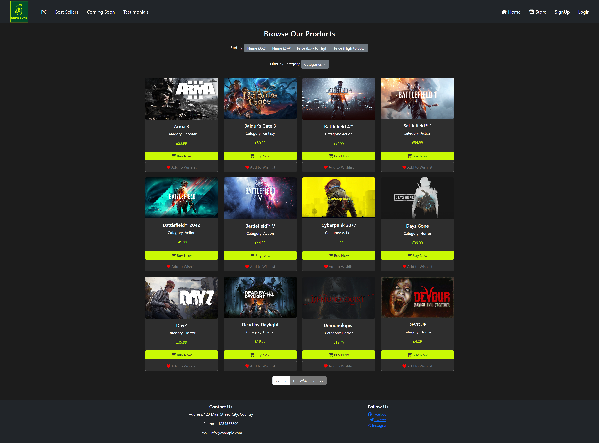
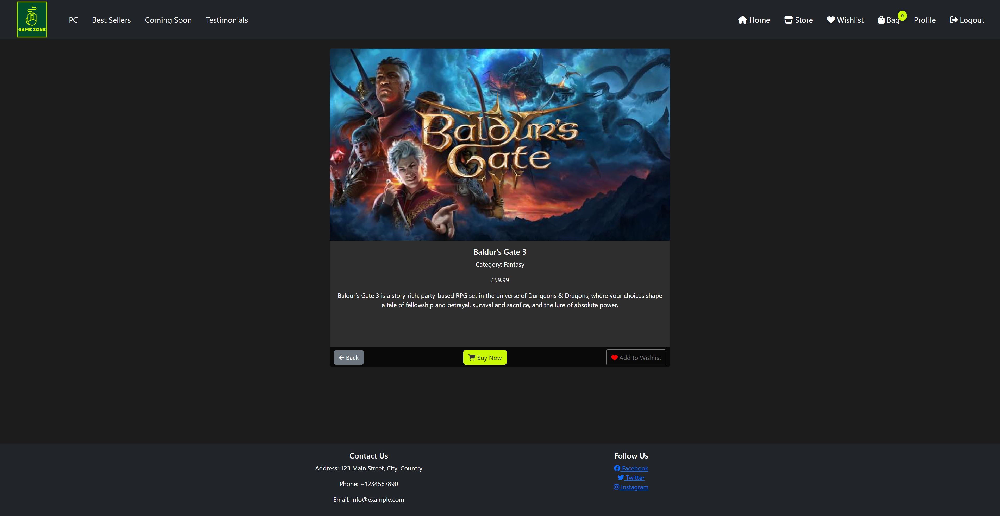

# Features

## Access to pages according to the user role:

| Page Name | Logged out  | Customers  | Admin |
| --------- | ----------- | ---------- | ----- |
| Home       | Yes         | Yes        | Yes   |
| Login      | Yes         | Yes        | Yes   |
| Register   | Yes         | Yes        | Yes   |
| Logout     | Yes         | Yes        | Yes   |
| Store Products   | Yes         | Yes        | Yes   |
| Store Product's Details | Yes         | Yes        | Yes   |
| Bag       | No         | Yes        | Yes   |
| Profile   | No         | Yes        | Yes   |
| Edit profile   | No         | Yes        | Yes   |
| Add address   | No         | Yes        | Yes   |
| All addresses   | No         | Yes        | Yes   |
| Edit address   | No         | Yes        | Yes   |
| My Orders   | No         | Yes        | Yes   |
| My Order's Details   | No         | Yes        | Yes   |
| My Wishlist   | No         | Yes        | Yes   |
| Checkout   | No         | Yes        | Yes   |
| Create newsletter-promo Email | No         | No         | Yes   |
| Categories | No         | No         | Yes   |
| Add category | No         | No         | Yes   |
| Edit category | No         | No         | Yes   |
| Delete category | No         | No         | Yes   |
| Product's values | No         | No         | Yes   |
| Add product's value | No         | No         | Yes   |
| Edit product's value | No         | No         | Yes   |
| Delete product's value | No         | No         | Yes   |
| Personnel Products Table | No         | No         | Yes   |
| Add product | No         | No         | Yes   |
| Edit product | No         | No         | Yes   |
| Delete product | No         | No         | Yes   |
| Personnel Product's full details | No         | No         | Yes   |
| Add new image modal | No         | No         | Yes   |
| Edit image modal | No         | No         | Yes   |
| Delete image modal | No         | No         | Yes   |
| Add product's unit | No         | No         | Yes   |
| Edit product's unit | No         | No         | Yes   |
| Add stock | No         | No         | Yes   |
| Edit stock | No         | No         | Yes   |
| Delete stock | No         | No         | Yes   |
| Stock table | No         | No         | Yes   |
| Orders | No         | No         | Yes   |
| Order's details | No         | No         | Yes   |
| Edit order status feature | No         | No         | Yes    |
| Edit Order | No         | No         | Yes   |
| Delete order | No         | No         | Yes   |
| Edit order's item | No         | No         | Yes   |

## Main Features:

- Each page has a navbar and a footer

### Navbar:

The Navbar has two subsections:

1. Customer's section, which is visible for all users:

    - if the user is logged in, the Navbar has the following features:

      

        - logo, which redirects to the home page;
        
        

        - Home button, which redirects the user to the home page

        - Store button, which redirects the user to the store page

        - Wishlist button, which redirects the user to the wishlist page

        - Bag button, which redirects the user to the bag page

        - Profile button, which redirects the user to the profile page

        - Logout button, which redirects the user to the login page

    - if the user is logged out, the Navbar has the following features:
    
      
      
        - logo:
        
        
        
        - It has only Home and Store page

        - Login button, which redirects the user to the login page

        - SignUp button, which redirects the user to the register page

### Footer:

Footer has the following features:

- contact information;

- Social media buttons: Instagram, Facebook, Twitter (the implementation is necessary for the future);

### Home page:

### Store page:

### Product's details page:

### My profile page:

### Edit Profile page:

### My addresses page:

### Add address page:

### My orders page:

### Wishlist page:

