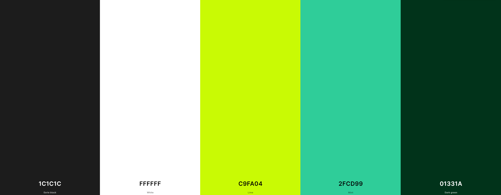

# E-commerce website

**Deployed website: [Link to website](#)**

**Card number for payment testing: **
## About

"Game Zone" is an e-commerce website that allows customers to buy online PC games. It provides a seamless experience with its login system, shopping cart, checkout system, and secure payment system. In addition, Game Zone features a comprehensive personnel system tailored for administrators. This system grants admins full control over managing the website's operations, including inventory management, user account administration, and site settings customization. With a focus on user experience and efficient backend management, Game Zone aims to redefine the way gamers shop for their favorite titles online.

---
## UX

The website was created to be eye-catching and user-friendly. The user is given plenty of choices to choose from when they are shopping. The emphasis is on the user experience; the user can navigate the website easily to fulfill users' goals. The website is designed to be easy to use and easy to understand. Additionally, the website attracts customers to become a part of newsletter program.

### Target Audience

This online store is tailored for PC gamers seeking to purchase a diverse selection of digital games. Whether you're into action, adventure, strategy, or simulation games, this platform offers an extensive collection to cater to all gaming preferences. The website is designed to engage gamers of all ages and experience levels, providing easy access to the latest releases and classic titles alike. The user interface is intuitively crafted for effortless navigation, ensuring a seamless browsing and purchasing experience.

### User Stories

#### First Time Visitor

| Issue ID    | User Story |
|-------------|-------------|
|[#1](https://github.com/aleksandrasucho/game-zone/issues/1)| As a First Time Visitor, I want to be able to register my account,, so that I can learn the benefits of the app as a user. |
|[#2](https://github.com/aleksandrasucho/game-zone/issues/2)|As a First Time Visitor I want to easily navigate the website to explore available video games.|
|[#3](https://github.com/aleksandrasucho/game-zone/issues/3)|As a First Time Visitor,, I want to be able to find the app useful, so that I can use it according to my needs.|
|[#4](https://github.com/aleksandrasucho/game-zone/issues/4)|As a First Time Visitor, I want to be informed clearly if I am making any errors when registering my account to promptly rectify any mistakes, ensuring a seamless registration process.|
|[#5](https://github.com/aleksandrasucho/game-zone/issues/5)|As a First Time Visitor, I want to be able to see the list of products, so that I can learn the benefits of the app as a user.|
|[#13]()||
|[#10]()||

#### Regular User (Customer)

| Issue ID    | User Story |
|-------------|-------------|
| [#6](https://github.com/aleksandrasucho/game-zone/issues/6) | As a Regular User, I want to easily log in to my account to access personalized features and preferences.|
| [#7](https://github.com/aleksandrasucho/game-zone/issues/7) |  As a Regular User, I want to be able to access my account without having to log in every time, so that I can quickly buy a product that I need.|
| [#8](https://github.com/aleksandrasucho/game-zone/issues/8) | As a Regular User, I want to be sure that my account details are protected, so that I can safely make purchases. |
| [#9](https://github.com/aleksandrasucho/game-zone/issues/9) |As a Regular User, I want to be able to easily check my account details and past orders for reference.|
| [#10](https://github.com/aleksandrasucho/game-zone/issues/10) |As a Regular User, I want to be able to add, edit, and save address details for faster ordering.|
| [#12](https://github.com/aleksandrasucho/game-zone/issues/12) | As a Regular User, I want to be able to sort products by category, so that I can find the best option to buy.|
| [#18](https://github.com/aleksandrasucho/game-zone/issues/18) | As a Customer, I want to Access detailed product descriptions, including images, options, and pricing, for informed decisions. |
| [#19](https://github.com/aleksandrasucho/game-zone/issues/19) |As a Customer, I want to be able to get notified via email about special offers, promotions, and discounts.|
| [#21](https://github.com/aleksandrasucho/game-zone/issues/21) |As a Customer, I want to be able to add or remove products from my wish list for convenient planning.|
| [#22](https://github.com/aleksandrasucho/game-zone/issues/22) |As a Customer, I want to be able to view products saved in my wish list to plan purchases effectively.|
| [#23](https://github.com/aleksandrasucho/game-zone/issues/23) |As a Customer, I want to be able to easily add products to my bag for streamlined shopping.|
| [#24](https://github.com/aleksandrasucho/game-zone/issues/24) |As a Customer, I want to be able to see the total cost of selected products to manage expenses.|
| [#25](https://github.com/aleksandrasucho/game-zone/issues/25) |As a Customer, I want to be able to check the total cost of products in my bag for budget planning.|
| [#26](https://github.com/aleksandrasucho/game-zone/issues/26) |As a Customer, I want to be able to delete products from my bag to adjust purchases.|
| [#28](https://github.com/aleksandrasucho/game-zone/issues/28) |As a Customer, I want to be able to check the status of my order to track its progress.|
| [#29](https://github.com/aleksandrasucho/game-zone/issues/29) |As a Customer, I want to receive confirmation after checkout to verify purchase details.|
| [#31](https://github.com/aleksandrasucho/game-zone/issues/31) |As a Regular user, I want to be able to change my profile data, so that I can keep my profile up to date.|
| [#33](https://github.com/aleksandrasucho/game-zone/issues/33) |As a Regular User, I want to be able to choose a primary address without editing it for faster selection.|

## Business Model

Game Zone operates on a B2C business model, catering exclusively to customers who seek to purchase online PC games. The focus lies on individual transactions, ensuring a seamless experience from browsing to checkout.

### A Persona Summary of the customer

Game Zone targets a wide range of gamers, acknowledging their diverse preferences and interests. With a minimum age requirement of 18, the platform aims to deliver exceptional service by facilitating easy navigation, presenting an extensive selection of games, and prioritizing user satisfaction.

### A persona summary of the store personnel

Game Zone serves as a platform for game developers and publishers seeking to market their products online. Whether it's a fledgling indie studio or a renowned AAA company, Game Zone offers robust personnel functionality to manage all aspects of the storefront, from categorization and tagging to inventory management and order processing, fostering potential growth opportunities.

### Strategy Trade-Off

Game Zone distinguishes itself in the competitive online gaming market through its comprehensive offerings and competitive pricing. Key strategic trade-offs include:

- Wide variety of game offerings
- Availability of popular titles
- Commitment to high-quality gaming experiences
- Diverse product choices to cater to different gaming preferences
- Emphasis on user-friendly interface and smooth shopping experience
- Exceptional customer service and support
- Fostering customer loyalty through personalized services and tailored recommendations

---

## SEO and Marketing

Please see  [SEO and Marketing](SEO_MARKETING.md) for an extensive overview of the marketing research for this project.

---
## Future Development

#### AI-Powered Customer Support

Game Zone envisions implementing AI-powered customer support to revolutionize user assistance. Leveraging cutting-edge technology, this feature will provide instant responses to common queries and seamlessly escalate complex issues to human agents for personalized assistance.

#### Sorting products by rating and reviews

This feature is fully dependent on the business requirements. And not all business requirements include this feature due to the customers' personal preferences.
#### Third-party registration

Facebook and Twitter were not considered for future development at this stage as they require additional information from the business. 
Google is the most popular third-party registration service that is easy to implement; however, it is not available in all countries and regions (like China).

#### Payment system

I want to implement PayPal payment system in the future as many customers prefer it.

#### Augmented Reality Game Previews

Game Zone is paving the way for augmented reality (AR) game previews, allowing gamers to experience trailers, gameplay snippets, and interactive demos in their real-world environment. This immersive approach provides a glimpse into the gameplay mechanics and graphics quality before making a purchase decision.

#### Order cancellation

This feature requires more research time to implement, which is why it is not implemented at this stage.

#### Social Gaming Events

In the future, Game Zone will host social gaming events, bringing together gamers from around the world for tournaments, challenges, and community-driven activities. These events will foster camaraderie, competition, and collaboration among players, enriching the gaming experience beyond solo gameplay.

---

## Technologies used
- ### Languages:
    
    + [Python](https://www.python.org/downloads/release/python-385/): the primary language used to develop the server-side of the website.
    + [JS](https://www.javascript.com/): the primary language used to develop interactive components of the website.
    + [HTML](https://developer.mozilla.org/en-US/docs/Web/HTML): the markup language used to create the website.
    + [CSS](https://developer.mozilla.org/en-US/docs/Web/css): the styling language used to style the website.

- ### Frameworks and libraries:

    + [Django](https://www.djangoproject.com/): python framework used to create all the logic.
    + [jQuery](https://jquery.com/): was used to control click events and sending AJAX requests.
    + [jQuery User Interface](https://jqueryui.com/) was used to create interactive elements.

- ### Databases:

    + [SQLite](https://www.sqlite.org/): was used as a development database.
    + [PostgreSQL](https://www.postgresql.org/): the database used to store all the data.

- ### Other tools:

    + [Git](https://git-scm.com/): the version control system used to manage the code.
    + [Pip3](https://pypi.org/project/pip/): the package manager used to install the dependencies.
    + [Gunicorn](https://gunicorn.org/): the web server used to run the website.
    + [Psycopg2](https://www.psycopg.org/): the database driver used to connect to the database.
    + [Django-allauth](https://django-allauth.readthedocs.io/en/latest/): the authentication library used to create the user accounts.
    + [Django-crispy-forms](https://django-cryptography.readthedocs.io/en/latest/): was used to control the rendering behavior of Django forms.
    + [Render](https://pypi.org/project/render/): was used to render the README file.
    + [GitHub](https://github.com/): used to host the website's source code.
    + [VSCode](https://code.visualstudio.com/): the IDE used to develop the website.
    + [Chrome DevTools](https://developer.chrome.com/docs/devtools/open/): was used to debug the website.
    + [Font Awesome](https://fontawesome.com/): was used to create the icons used in the website.
    + [Draw.io](https://www.lucidchart.com/) was used to make a flowchart for the README file.
    + [Coolors](https://coolors.co/202a3c-1c2431-181f2a-0b1523-65e2d9-925cef-6b28e0-ffffff-eeeeee) was used to make a color palette for the website.
    + [BGJar](https://www.bgjar.com/): was used to make a background images for the website.
    + [W3C Validator](https://validator.w3.org/): was used to validate HTML5 code for the website.
    + [W3C CSS validator](https://jigsaw.w3.org/css-validator/): was used to validate CSS code for the website.
    + [JShint](https://jshint.com/): was used to validate JS code for the website.
    + [PEP8](https://pep8.org/): was used to validate Python code for the website.
    + [Multiple Video & Image Upload Plugin - jQuery Miv.js](https://www.jqueryscript.net/form/multi-video-image-upload.html) was used to upload multiple videos and images. **Note:** the plugin  is using special characters in css and js files that I am aware about!
    + [stripe](https://stripe.com/): was used to create the payment system.
    + [Sitemap Generator](https://www.xml-sitemaps.com/) was used to create the sitemap.xml file.
    + [Privacy Policy Generator](https://www.privacypolicygenerator.info/) was used to create the privacy policy.
    + [Django-extensions](https://django-extensions.readthedocs.io/en/latest/) was used to create a Entity-Relationship Diagram.

---

## Features

Please refer to the [FEATURES.md](FEATURES.md) file for all test-related documentation.

---
## Design

The design of Game Zone is inspired by Material Design principles, with a focus on delivering an exceptional user experience. The color palette chosen for the website/application is carefully curated to align with Material Design principles, ensuring coherence and visual harmony.

### Color Scheme

With those color codes, you can create a sleek and modern design. This scheme provides a high contrast between the text and background, with pops of neon green for highlighted elements and a range of green tones for accents. The varying opacity levels of black can be used for subtle depth and shadow effects.

  

  