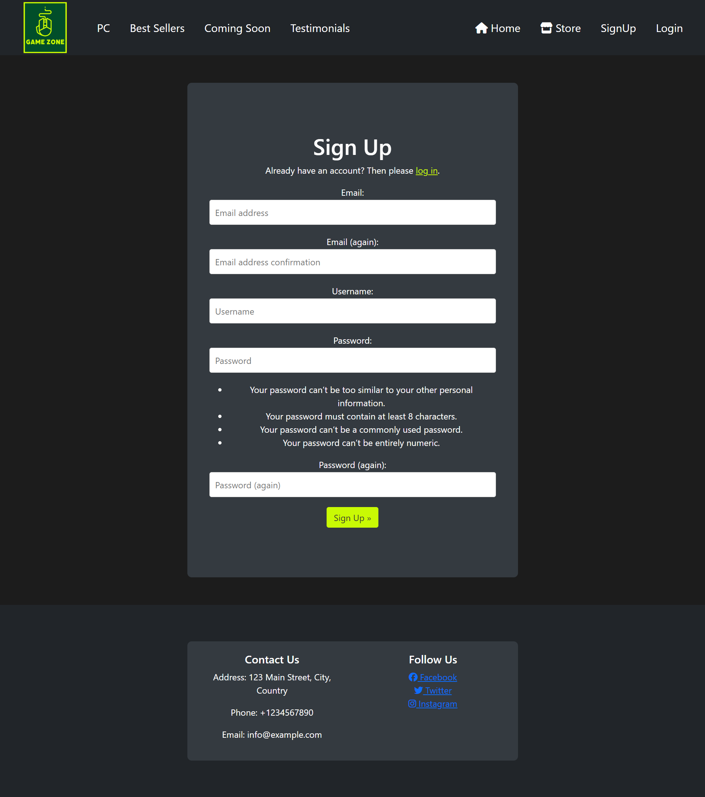
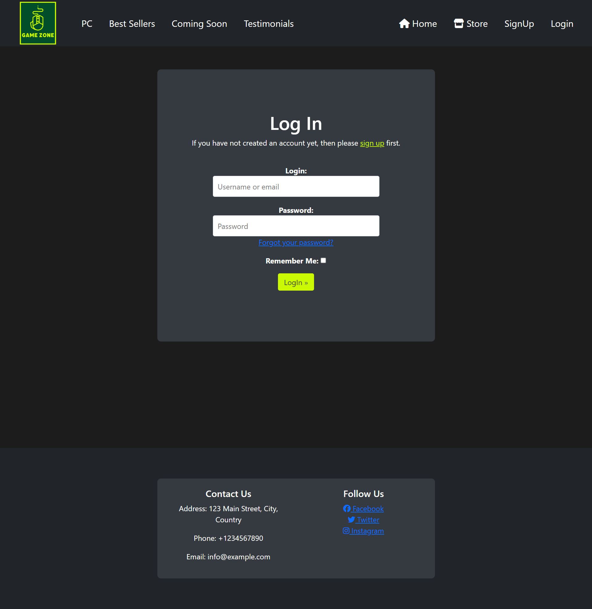
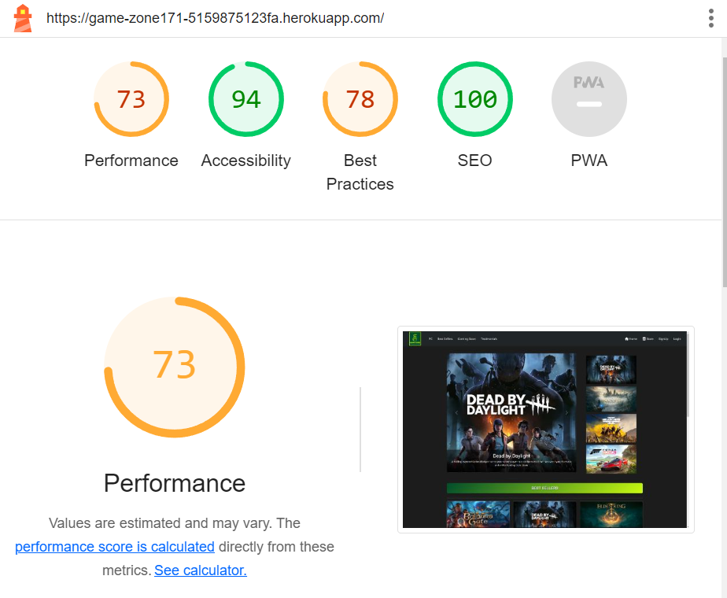

# TESTING

## Manual Testing

Testing was done throughout site development, for each feature before it was merged into the master file.

Usability was tested with the below user acceptance testing, sent to new users to ensure testing from different users, on different devices and browsers to ensure issues were caught and where possible fixed during development.

| Page    | User Actions           | Expected Results | Y/N | Comments    |
|-------------|------------------------|------------------|------|-------------|
| Sign Up     |                        |                  |      |             |
| 1           | Click on Sign Up button | Redirection to Sign Up page | Y |          |
| 2           | Click on the Login link in the form | Redirection to Login page | Y |          |
| 3           | Enter valid email 2 times | Field will only accept email address format | Y |          |
| 4           | Enter valid password 2 times | Field will only accept password format | Y |          |
| 5           | Click on Sign Up button | asks user to confirm email page Sends address a confirmation request email | Y |          |
| 6           | Confirm email | Redirects user to blank Sign In page | Y |          |
| 7           | Sign In | Redirects user to blank In page | Y |          |
| 8           | Sign In with the same email/username and password | Takes user to schedule page with pop-up confirming successful sign in. Get started button now missing in main nav, replaced by Menu | Y |          |
| 9           | Click "Logout" button  in the center of the page| Redirects user to home page | Y |          |
| 10          | Click browser back button | You are still logged out | Y |          |
| Log In      |                        |                  |      |             |
| 1           | Click on Log In button | Redirection to Log In page | Y |          |
| 2           | Click on the Sign Up link in the form | Redirection to Sign Up page | Y |          |
| 3           | Enter valid email | Field will only accept email address format | Y |          |
| 4           | Enter valid password | Field will only accept password format | Y |          |
| 5           | Click on Log In button | Redirects user to blank In page | Y |          |
| 6           | click logout button | Redirects user to home page | Y |          |
| 7           | Click browser back button | You are still logged out | Y |          |
| 8           | Click on Log In button | Redirection to Log In page | Y |          |
| 9           | Enter valid email | Field will only accept email address format | Y |          |
| 10          | Enter valid password | Field will only accept password format | Y |          |
| 11          | Click Remember Me checkbox | Remembers user | Y |          |
| 12          | Click on Log In button | Redirects user to blank In page | Y |          |
| 13          | Click logout button | Redirects user to home page | Y |          |
| 14          | Click browser back button | You are still logged out | Y |          |
| 15          | Click on Log In button | Redirection to Log In page prefilled | Y |          |
| Navigation  |                        |                  |      |             |
| 1           | Click on the logo | Redirection to home page | Y |          |
| 2           | Click Store | Redirection to Store page | Y |          |
| 3           | Click wishlist button | Redirection to wishlist page | Y |          |
| 4           | Click bag button | Redirection to bag page | Y |          |
| 5           | Click Profile button | Redirection to Profile page | Y |          |
| 6           | Click Logout button | Redirection to logout page | Y |          |
| Store |                        |                  |      |             |
| 1  | Select a category | Products are displayed | Y |          |
| 2  | Click on Add to wishlis button | Product is added to wishlist and message will appear to notify user | Y | If user is logged out, the user will see a message to login and the click will be ignored |
| 3 | Click on the product cart | User will be redirected to the product details page | Y | |
| 4 | Click on page navigation | User will be redirected to the correct page | Y | |
| Product Details |                        |                  |      |             |
| 1 | Click on heart button | Product is added to wishlist and message will appear to notify user | Y | If user is logged out, the user will see a message to login and the click will be ignored |
| 2 | Click on add to bag button | Product is added to bag and message will appear to notify user | Y | If user is logged out, the user will see a message to login and the click will be ignored |
| Wishlist |                        |                  |      |             |
| 1 | Click on the product card's heart button | The product will be removed from the wishlist and the message will appear to notify user | Y | If user is logged out, the user will see a message to login and the click will be ignored |
| Profile |                        |                  |      |             |
| 1 | Click on the edit button | User will be redirected to the edit profile page | Y | |
| 2 | Click on the add address button | User will be redirected to the add address page | Y | |
| 3 | Click on the manage addresses button | User will be redirected to the manage addresses page | Y |  |
| 4 | Click on the My Orders button | User will be redirected to the My Orders page | Y | |
| 5 | Click on the My Wishlist button | User will be redirected to the My Wishlist page | Y | |
| Edit Profile |                        |                  |      |             |
| Edit profile Avatar | | | | |
| 1 | Click on the edit button | User will see a pop up window to upload an avatar | Y | |
| 2 | Click on the upload button | User will see a pop up window to upload an avatar | Y | |
| 3 | Click on the cancel button | Changes will not be confirmed | Y | |
| 4 | Click on the save button | Changes will be confirmed and the avatar will be changed | Y | |
| 5 | Click on the Delete button | User will see a pop up window to confirm the deletion | Y | |
| Edit Profile Data |                        |                  |      |             |
| 1 | Type in the first name | First name is changed | Y | |
| 2 | Type in the last name | Last name is changed | Y | |
| 3 | Click Save changes button | Changes will be confirmed and the user will see a message to notify them | Y | |
| Edit Password |                        |                  |      |             |
| 1 | Type in the old password | Old password is changed | Y | |
| 2 | Type in the new password | New password is changed | Y | |
| 3 | Type in the new password confirmation | New password confirmation is changed | Y | |
| 4 | Click Save changes button | Changes will be confirmed and the user will see a message to notify them | Y | |
| Delete Account |                        |                  |      |             |
| 1 | Click on the Delete button | User will see a dropdown menu with the confirmation message | Y | |
| 2 | Click Yes button in the dropdown menu | User will be redirected to the home page and the message will appear to notify user | Y | |
| 3 | Click No button in the dropdown menu | The dropdown menu will be closed | Y | |
| My addresses |                        |                  |      |             |
| 1 | Click on the add address button | User will be redirected to the add address page | Y | |
| 2 | Click on the edit button on the address card | User will be redirected to the edit address page | Y | |
| 3 | Click on Enable as Primary button | Address is set as primary | Y | If there were another primary address, it will be set as not primary |
| 4 | Click on Disable as Primary button | Address is set as not primary | Y | |
| Add Address |                        |                  |      |             |
| 1 | Select country | Country is selected | Y | |
| 2 | Select state | State is selected | Y | |
| 3 | Select city | City is selected | Y | |
| 4 | Type in the address | Address is changed | Y | |
| 5 | Type in a zip code | Zip code is changed | Y | |
| 6 | Type in the phone number | Phone number is changed | Y | |
| 7 | Check primary checkbox | Address is set as primary | Y | |
| 8 | Click Save changes button | Changes will be confirmed and the user will see a message to notify them | Y | |
| 9 | Click on the cancel button | Changes will not be confirmed and the user will be redirected to the manage addresses page | Y | |
| Edit Address |                        |                  |      |             |
| 1 | Select country | Country is selected | Y | |
| 2 | Select state | State is selected | Y | |
| 3 | Select city | City is selected | Y | |
| 4 | Type in the address | Address is changed | Y | |
| 5 | Type in a zip code | Zip code is changed | Y | |
| 6 | Type in the phone number | Phone number is changed | Y | |
| 7 | Check primary checkbox | Address is set as primary | Y | |
| 8 | Click Save changes button | Changes will be confirmed and the user will see a message to notify them | Y | |
| 9 | Click on the cancel button | Changes will not be confirmed and the user will be redirected to the manage addresses page | Y | |
| 10 | Click on Delete address button | User will see a dropdown menu with the confirmation message | Y | |
| 11 | Click Yes button in the dropdown menu | User will be redirected to the manage addresses page and the message will appear to notify user | Y | |
| 12 | Click No button in the dropdown menu | The dropdown menu will be closed | Y | |
| Bag |                        |                  |      |             |
| 1 | Click on buy now button | redirected to checkout| Y | |
| 2 | Click on the remove button | Product is removed from the bag and the user will see a message to notify them | Y | |
| Checkout |                        |                  |      |             |
| 1 | Type in the Full name | Full name is changed | Y | If user has filled out the profile fully, the filled will be filled automatically |
| 2 | Type in the email | Email is changed | Y | |
| 3 | Type in the phone number | Phone number is changed | Y | If user has set the primary address, the phone number will be set automatically |
| 4 | Type in the address | Address is changed | Y | If user has set the primary address, the address will be set automatically |
| 5 | Type in the zip code | Zip code is changed | Y | If user has set the primary address, the zip code will be set automatically |
| 6 | Select country | Country is selected | Y | If user has set the primary address, the country will be set automatically |
| 7 | Select state | State is selected | Y | If user has set the primary address, the state will be set automatically |
| 8 | Select city | City is selected | Y | If user has set the primary address, the city will be set automatically |
| 9 | Type payment card data | Payment card data is changed | Y | |
| 10 | Click on the pay button | The pay button will be disabled and the user will see a message to notify them | Y | If the payment card is not valid, the user will see a message to notify them. If the payment was successful, the user will be redirected to the order placed page and user will also receive an email notification |
| Order Placed |                        |                  |      |             |
| 1 | Click on the View my orders button | User will be redirected to the My Orders page | Y | |

## Testing User Story

| First Time Visitor Goals | Requirement met | Image |
| ------------------------- | --------------- | ----- |
| As a First Time Visitor, I want to be able to register my account,, so that I can learn the benefits of the app as a user. | Y |  |
|  As a First Time Visitor I want to easily navigate the website to explore available video games. | Y |  |
| As a First Time Visitor,, I want to be able to find the app useful, so that I can use it according to my needs. | Y |  |
|As a First Time Visitor, I want to be informed clearly if I am making any errors when registering my account to promptly rectify any mistakes, ensuring a seamless registration process. | Y | |
| As a First Time Visitor, I want to be informed clearly if I am making any errors when registering my account, so that I can be able to fix any errors quickly if I make some. | Y |  |
| As a First Time Visitor, I want to be able to see the list of products, so that I can learn the benefits of the app as a user.| Y |  |

| Frequent Visitor Goals    | Requirement met | Image |
| ------------------------- | --------------- | ----- |
| As a Regular User, I want to easily log in to my account to access personalized features and preferences. | Y |  |
| As a Regular User, I want to be able to access my account without having to log in every time, so that I can quickly buy a product that I need. | Y |  |
| 	As a Regular User, I want to be able to easily check my account details and past orders for reference.| Y |  |
| 	As a Regular User, I want to be able to add, edit, and save address details for faster ordering.| Y |  |
| 	As a Regular User, I want to be able to sort products by category, so that I can find the best option to buy.| Y |  |
| 	As a Customer, I want to Access detailed product descriptions, including images, options, and pricing, for informed decisions.| Y |  |
| As a Customer, I want to be able to get notified via email about special offers, promotions, and discounts.| Y |  |
| 	As a Customer, I want to be able to add or remove products from my wish list for convenient planning.| Y |  |
| 	As a Customer, I want to be able to view products saved in my wish list to plan purchases effectively.| Y |  |
| 	As a Customer, I want to be able to easily add products to my bag for streamlined shopping.| Y |  |
| 	As a Customer, I want to be able to see the total cost of selected products to manage expenses.| Y |  |
| 	As a Customer, I want to be able to check the total cost of products in my bag for budget planning.| Y |  |
| 	As a Customer, I want to be able to delete products from my bag to adjust purchases.| Y |  |
| 	As a Regular user, I want to be able to change my profile data, so that I can keep my profile up to date.| Y |  |
| 	As a Regular User, I want to be able to choose a primary address without editing it for faster selection.| Y |  |

## Responsiveness Testing

The deployed website underwent extensive testing across a spectrum of devices and screen sizes to guarantee its responsiveness and adaptability. Developer Tools were instrumental in simulating diverse screen dimensions, facilitating a comprehensive evaluation of the website's behavior on various devices.
A combination of Bootstrap classes, custom CSS, and template syntax played a pivotal role in crafting the desired design. This strategic implementation not only ensured visual consistency but also maintained functional integrity across different platforms. By leveraging these tools and techniques, the website is poised to deliver an optimized user experience, regardless of the device being used.

## Bugs

### Solved bugs

There were plenty of bugs during the development process since this project was a learning platform for me and allowed me to improve my skills and knowledge significantly.

1. Django Improperly Configured Error: I encountered the django.core.exceptions.ImproperlyConfigured: allauth.account.middleware.AccountMiddleware must be added to settings.MIDDLEWARE error.
- *Solutions:* The issue has been addressed by adding allauth.account.middleware.AccountMiddleware to the settings.MIDDLEWARE as per the Django configuration requirements.

2. gunicorn.errors.HaltServer: <HaltServer 'Worker failed to boot.' 3> django
- *Solutions:* The issue has been resolved by investigating and fixing the underlying cause, allowing the Gunicorn server to start successfully.

---
## Lighthouse Report

### Home Page

### StorePage

### Wishlist Page

### Login Page

### Signup Page

### Bag Page

---

## Compatibility

Testing was conducted on the following browsers;

- Brave;
- Chrome;
- Firefox;

# Responsiveness

The responsiveness was checked manually by using devtools (Chrome) throughout the whole development.